Quase um mês depois, venho com notícias. E o melhor de tudo: todas são boas notícias. Hoje é o 6º dia que estou em Dublin e estou achando sensacional! Era bem o que eu esperava - não digo da Irlanda, sim da sensação de estar em um lugar novo - estou gostando demais das novas experiências, amigos e de poder colocar o idioma inglês em prática a qualquer momento. E já que os familiares e amigos estão me cobrando notícias (e eu também estou me cobrando guardar essas recordações), nada melhor de que um bom <i>blogpost</i> pra mostrar um pouquinho do que passei nos últimos dias.

## // Burocracias no Brasil

A 1ª mega notícia é que eu tive de enfrentar burocracias brasileiras. Na verdade eu tenho um certo pavor dessa palavra pelos problemas e tédio que ela pode me causar, mas dessa vez foi diferente: eu nunca fiquei tão satisfeito de correr atrás de resolver burocracias. Faço uma analogia ao caso de alguém estar satisfeito por pagar uma quantidade maior de imposto de renda: quanto mais imposto se paga, maior o salário. Sem mais delongas, a boa notícia é que deu tudo certo sobre eu sair da empresa em que trabalhava, no status de **demitido** :DDD. As burocracias que tive de resolver - e com velocidade, pois tive apenas os dois dias que antecederam a viagem - foram: homologação de rescisão do contrato de trabalho junto ao sindicato, recolhimento do FGTS e multa de rescisão contratual junto a Caixa Econômica e entrada no seguro-desemprego junto a Secretaria de Trabalho do DF. Só o **ouro** véi! Fiz tudo isso com sorriso de orelha a orelha - mesmo tendo sido um saco as filas e enfrentar os pequenos problemas que apareceram durante a resolução.

## // Arrumando as malas

A única coisa que eu comprei antes de viajar foram meus óculos. Há pouco tempo eu perdi meu antigo (que não era antigo, 6 meses no máximo) par de óculos e já estava completando quase um mês com a miopia nua - para o meu grau (o.d: 0.75, o.s: 1.25) é até possível sobreviver andando na rua, mas é um encomodo <i>da peste</i>.

Panos (a.k.a roupas) e derivados eu deixaria pra comprar por aqui pois já tinha verificado que é bem mais barato. E eu realmente preciso de novos panos, pois até hoje eu me visto de acordo com o que as pessoas gostam, e o pior: eu passo muito tempo usando as mesmas roupas. Quem me conhece ou até quem apenas me viu sabe que roupas não são uma preocupação em minha vida. <strike>Foda-se eaiheaih</strike>.

Eu tenho minhas *tech-coisinhas*. São bens materiais que fazem parte do meu dia a dia e que dou imenso valor. Eu não pretendo somar uma grande quantidade de equipamentos eletrônicos: se eu tenho esses <i>gadgets</i> hoje são porque eles realmente são úteis na minha rotina. Faz parte de um estilo mais minimalista que eu venho seguingo há algum tempo. Não pretendo ter muitas coisas físicas (segundo minha vó: os <a href="http://goo.gl/VtBEQT" target="_blank">cacarecos</a>), assim qualquer mudança será menos dolorosa. Claro, isso não serve apenas pra mudanças: é mais econômico, custo de manutenção reduzido, menos peso, menos poeira etc.

Então eu fiz essa mala de roupas (reparem no tamanho):

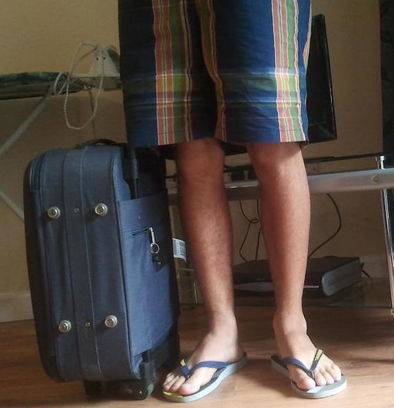

E trouxe uma mochila com meus cacarecos eletrônicos:

* Macbook
* Headphones
* Kindle
* Celular - no bolso
* HD externo

Um computador; algo que me proporcione música de excelente qualidade; um dispositivo que pode carregar milhares de livros e que é agradável de ler; um smartphone e um pendrive tamanho família. Eu preciso de mais alguma coisa?

## // Viajando

"No brilho dessa morena, amanheci no verão" - Ventania

O dia da viagem começou ótimo! Em nenhum momento no blog eu fiz menção de uma pessoa que *é* muito importante pra mim. De forma alguma é ressentimento e sim receio do quê eu escreva possa causar. No brilho dessa morena (bem nêga mesmo) linda, amanheci. A Larissa foi minha primeira e única namorada até hoje. É uma pessoa incrível: bonita, inteligente, gente boa, divertida, companheira; e pra não dizer apenas coisas boas, vez ou outra ela consegue ser bem charope, ácida e <i>reclamona</i>. De qualquer forma, eu a acho sensacional do jeito que é.

O nosso namoro acabou perto de completar 5 anos de idade. Dentre o intercâmbio como uma menor parte, existem lá meus motivos - que não quero entrar em detalhes pelo 'receio do quê eu escreva possa causar'.

Ela fez uma tortuosa viagem à minha casa em *Valparadise Lost City* e me ajudou a arrumar as malas; lembrar daquilo que não podia esquecer e me encheu de carinho pra que eu a desse um adeus babando e todo apaixonado. Linda!

### /\* ... \*/

No dia seguinte, acompanhado da ilustre 'minha mãe' e da celébre 'minha vó' fui ao aeroporto de BSB. Com antecedência no compromisso, realizei os <i>check-ins</i> e aguardei, agora acompanhado também do exímio 'meu pai'.

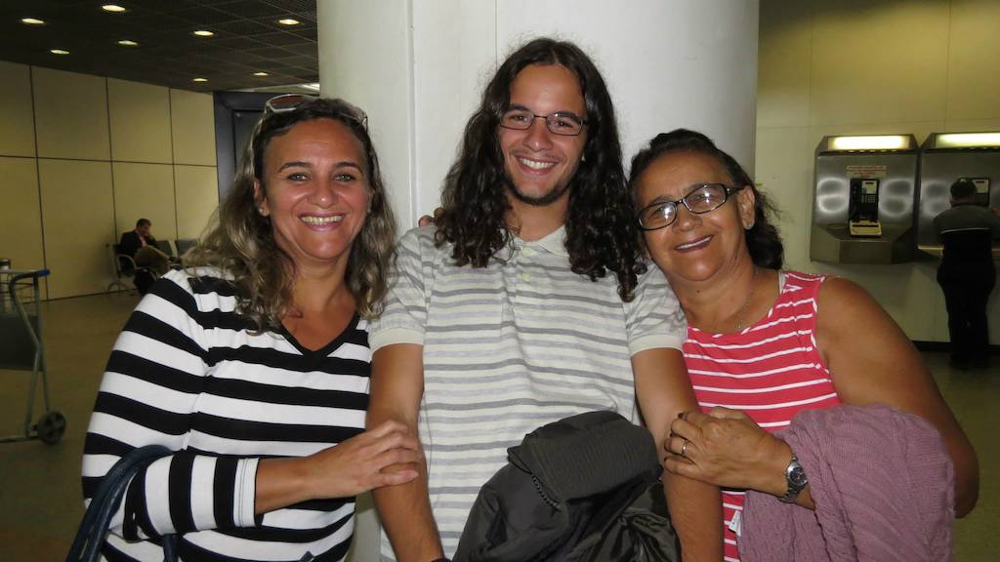
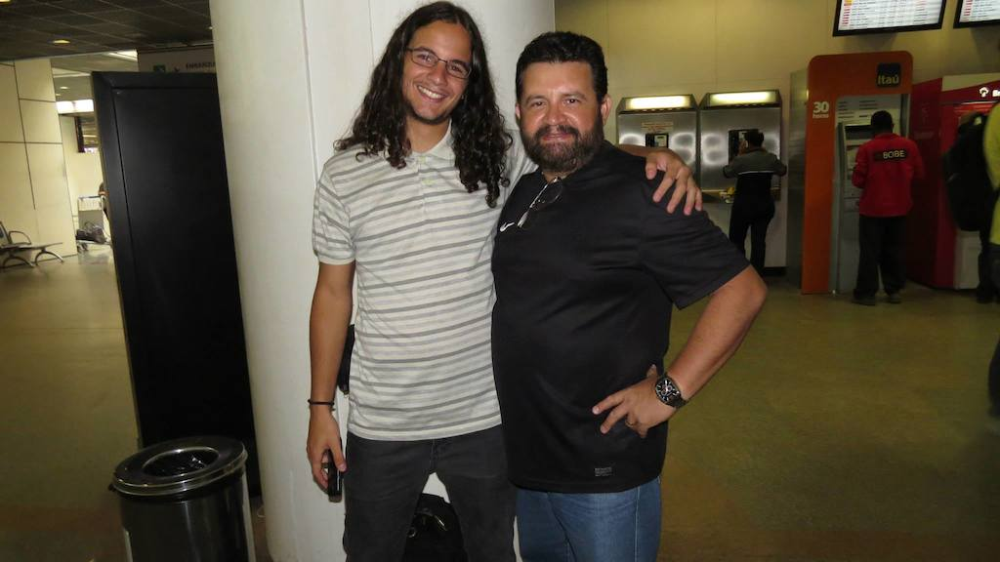

Obrigado pessoal, o 'não-chororô' de vocês foi muito importante. Me passou a confiança de que eu estava passando confiança.

O primeiro destino foi Guarulhos. De primeira já cometo aquela falha típica que só eu mesmo... Desci do avião e deixei a bela jaqueta que ganhei do <i>brother</i> Toninho no bagageiro ¬¬. Aff, era a única coisa que eu estava levando pra me esquentar do frio que estava por vir. Percebi isso apenas quando estava indo fazer o check-in para o vôo com destino a Madrid. Voltei para o desembarque, falei com uma segurança que logo contatou um outro cara que foi atrás da jaqueta. Ufa, ele conseguiu achar e assim continuei pro meu destino.

Três horas de espera em Guarulhos e finalmente a partida para o próximo destino, Madrid. O ambiente já começou a mudar. Um avião *beeem* maior, com 3 fileiras de cadeiras. A partir de agora todas as informações eram dadas em espanhol e inglês. Agora ao invés de ter de assistir, quase que obrigatoriamente, ao programa da Angélica entrevistando não sei qual artista da globo eu estava escutando música clássica no avião: ahh, realmente estava começando a melhorar.

No vôo BSB->GRU eu fui sozinho, com as poltronas laterais liberadas. E para minha incrível sorte, novamente eu estava sozinho no vôo pra Madrid: em um vôo que duraria mais de que 10 horas, isso me deixou bastante satisfeito. Durante a noite, depois de ver um filme, peguei aquele cobertozinho maroto da Ibéria, tirei meu tênis, ajustei minhas pernas de uma forma que me coubesse deitado nos dois bancos e dormi como um bebê - claro que não foi tão confortável assim e eu acordei diversas vezes durante a noite, mas de qualquer forma eu fiquei bastante satisfeito.

Conheci os dois brasileiros que estavam no banco da frente: Natasha que estava indo pra Milão e Diego, um músico carioca que estava indo pra <i>playá</i> com os amigos pela cidade de Lisboa. Estou mantendo contato com esse malucão pelo facebook. Bem gente boa a <i>peça</i>.

Gostei da comida servida pela Ibéria. Foram duas refeições que me deixaram satisfeito por toda a viagem. A primeira foi pedaços de peito de frango em um molho não sei do quê, com brócolis, cenoura e purê de batatas; saladinha com salame; pão; biscoito; um polenguinho; suco e um bolinho de sobremesa. A segunda foi um sanduiche de presunto e queijo; um bolo; mini salada de frutas; suco; água e um chocolate.

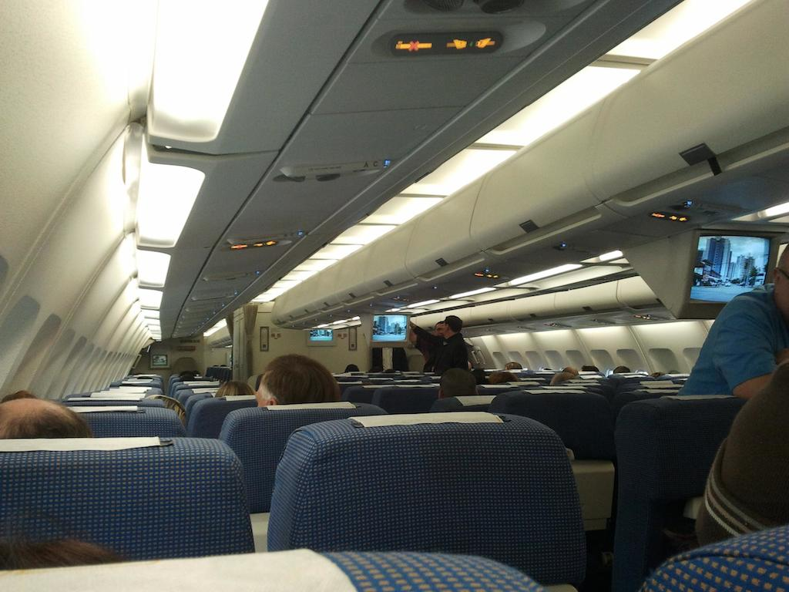
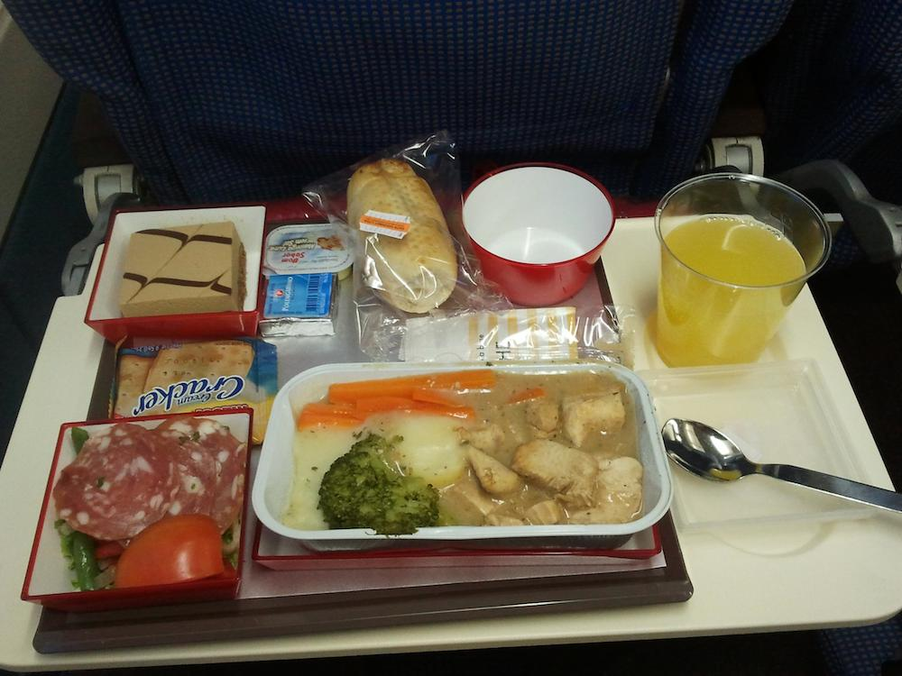
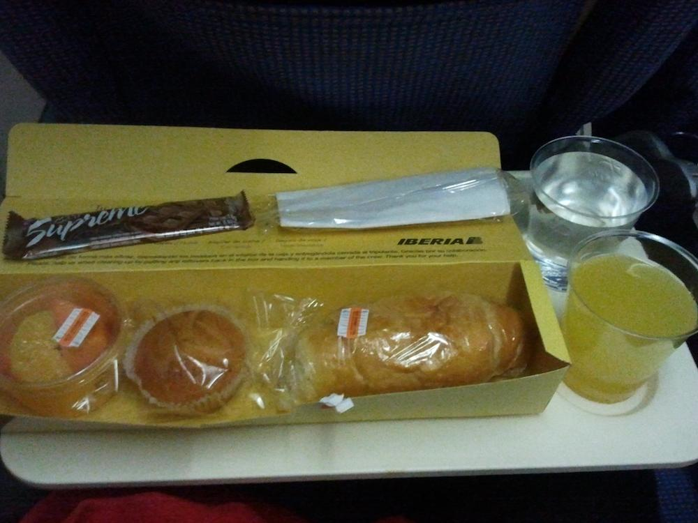

O aeroporto de Madrid é gigante, fiquei impressionado! Precisei pegar 2 metrôs para chegar ao meu portão de embarque e depois de esperar as 6 horinhas pelo voo MAD->DUB. Conheci um malucão de São Paulo na espera e ficamos conversando durante várias horas. Ele veio bem na louca e sem atender um requisito mínimo para a entrada na Irlanda: ter 3 mil euros. Ele parecia não saber se isso era realmente necessário, isso porque estava vindo por uma agência. O momento da loucura vem agora, por que mesmo sem conhecer esse cara direito (ele me passou confiança) eu emprestei 500 euros para que ele pudesse comprovar que tinha toda a grana. A idéia era que eu emprestasse esse dinheiro pra ele apenas passar na imigração e depois me devolvesse. Foi o que aconteceu, mas depois eu fiquei achando toda essa situação meio esquisita e me senti burro por ter feito isso. Se desse algum problema eu ia me dar mal demais. De qualquer forma, ficou o aprendizado e tenho certeza que não vou mais passar por esse tipo de situação. No final ele ficou bem agradecido e eu aliviado de não ter dado nenhum problema.

No aeroporto de Madrid também conheci o Felipe, um cara que trabalha na agência pela qual vim. Foi bem legal ele ter me encontrado, assim ele já foi me explicando diversas coisas durante a viagem e quando chegamos em Dublin tive uma consultoria personalizada na entrega dos documentos e como proceder na imigração. Ele também ia pegar o mesmo <i>transfer</i> que eu e assim me apresentar a residência onde estou. Bom demais, menos preocupações.

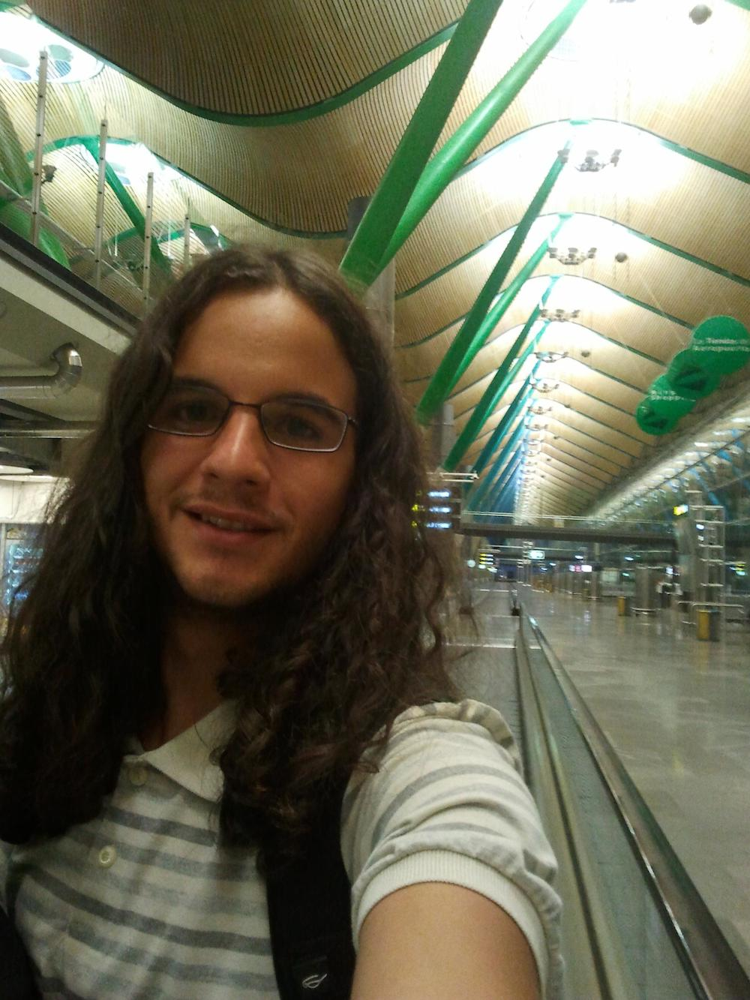
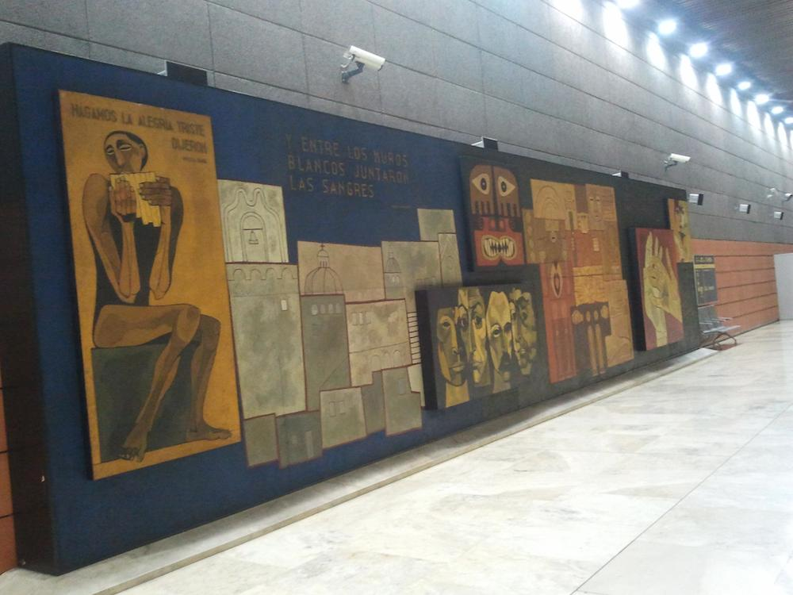

## // A chegada

I<i>rish sea, cold wind and green grass!</i> A sensação foi ótima de descer do avião e olhar umas vaquinhas malhadas em um pasto verde imenso bem ao lado do aeroporto.

O transfer já estava nos esperando, o Felipe me emprestou o celular para que eu pudesse ligar pro meu pai e dar notícias. O apartamento onde estou fica bem no centro de Dublin, em Dublin 1, próximo ao <i>Spire</i>. Logo, conheci o minêro Alan - my flatmate -, gente boa demais da conta. Já ficamos <i>brothers</i> de início e de tarde fomos dar um pequeno passeio pela cidade pra ele me apresentar alguns lugares. É isso aí, começou o momento pelo qual eu estava tão ancioso.

De início, já saí com o Alan pra dar uma sondada no local. Andamos pelas ruas e fomos ao mercado comprar algumas coisinhas pra mim. As coisas no mercado são até baratas. Comprei do básico e não fiquei olhando muito o que tem de diferente. Pão, leite, queijo, mortadela, batatas, ovos, arroz, suco, biscoitos etc: só a sobrevivência inicial.

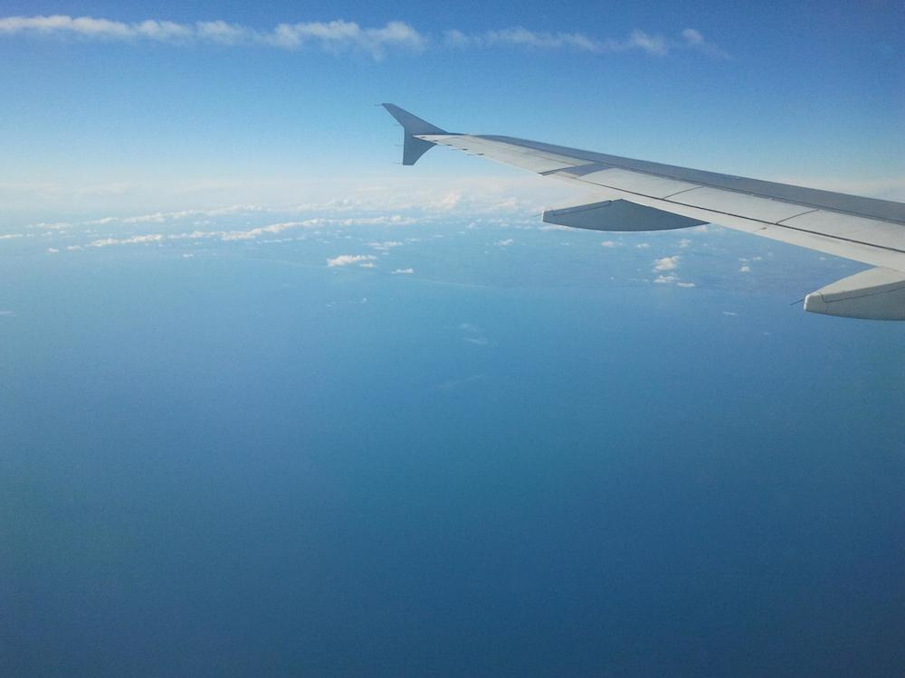
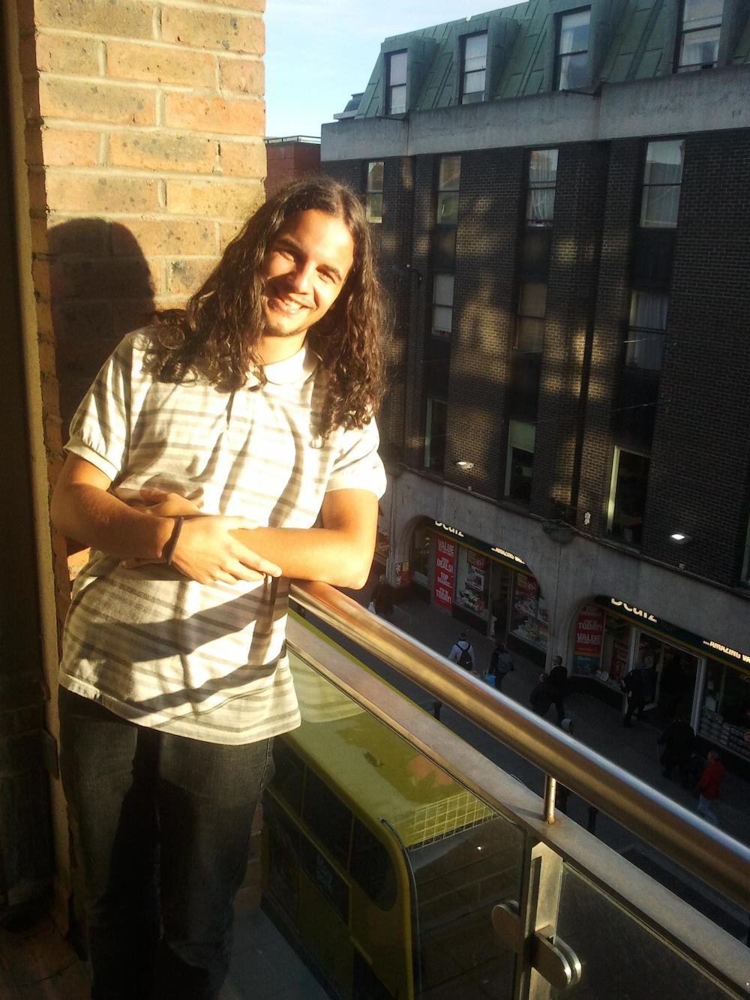
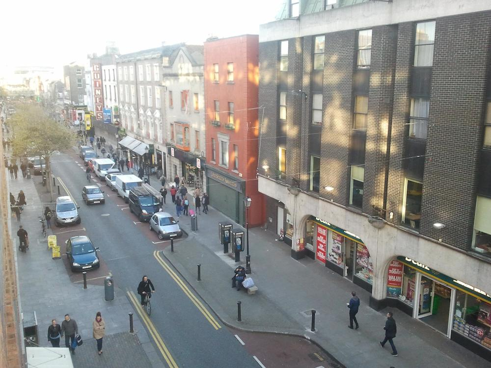
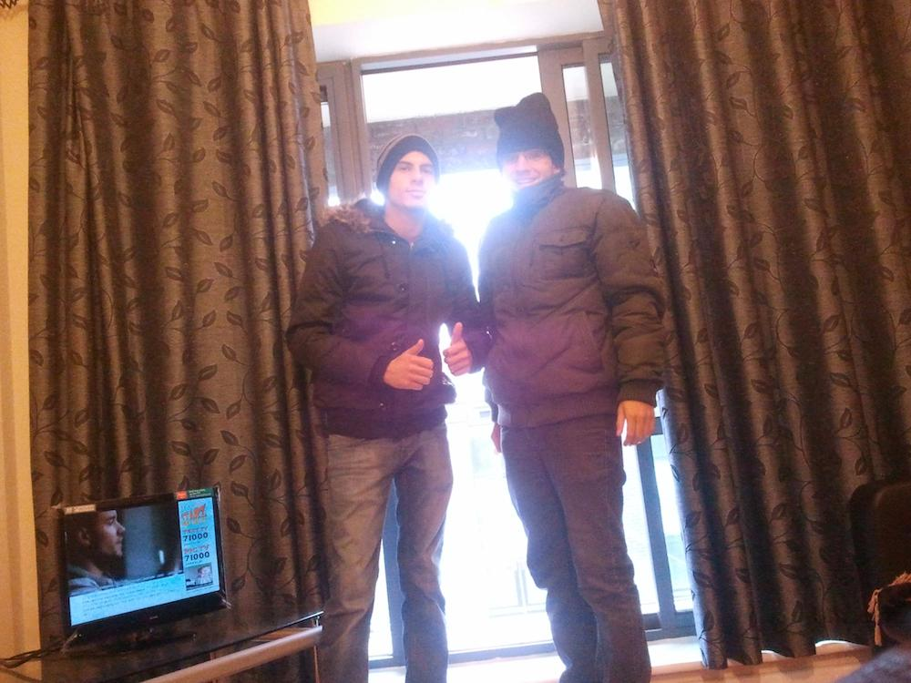
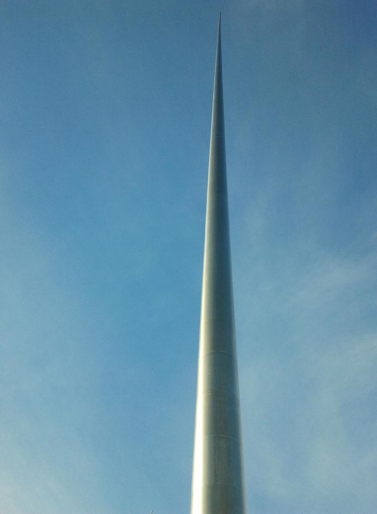
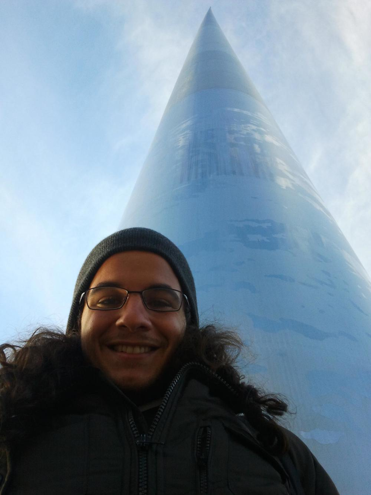

Cheguei na sexta, logo, não deu outra: saí pra conhecer alguns <i>pubs</i> por aqui. Os <i>pubs</i> que fui são bem legais, diversos deles com música ao vivo (normalmente voz e violão), cada um com diversas cervejas e bebidas diferentes e um clima bem agrádavel pra passar uma noite toda bebendo. Todos os que passei são lugares bem agrádaveis pra se ficar e ainda: não pedem nenhum tipo de pagamento, seja pela entrada ou <i>couver</i>. Tomei minha primeira <i>Guinness</i> e achei ótima! A parte ruim é que eu não posso ficar tomando várias dessas <i>guinness</i>, é chato ficar com a conversão real->euro na cabeça, mas por enquanto não tem jeito. Tenho que ver como vai ser o primeiro mês pra me situar com os custos. A média de uma <i>Guinness</i> (ou qualquer outro copão de cerveja do mesmo tamanho) é de €5 (R$15).

Algo que me deixou muito feliz por aqui são as músicas que eu tenho escutado nos <i>pubs</i> e na rua. O que eu tenho escutado por aí são coisas do tipo: música tradicional irlandesa (celta), Beatles, Oasis, Led Zeppelin, Cardigans, U2, Radiohead, Rolling Stones dentre outras. Falando em música...

## // Buskers

Buskers são músicos que se apresentam aqui nas ruas de Dublin (ou de qualquer outra cidade) para conseguir tirar uma grana. O legal é que aqui funciona e depende apenas do talento e esforço dos músicos. O que eu vejo aqui é que o pessoal realmente pára pra escutar se o <i>busker</i> for talentoso. E claro, ele também é gratificado com alguns <i>cents</i>, normalmente no <i>bag</i> do seu instrumento que fica aberto.

Eu curti isso demais e inclusive contribuo quando acho o trabalho bom. Fiz algumas filmagens (e pretendo continuar fazendo) desses caras:

<object class="post-video">
  <embed src="http://www.youtube.com/v/POmCrQXphaE" type="application/x-shockwave-flash" allowscriptaccess="always" allowfullscreen="true" width="100%" height="385"></embed>
</object>

<object class="post-video">
  <embed src="http://www.youtube.com/v/BcuUwKM_EAg" type="application/x-shockwave-flash" allowscriptaccess="always" allowfullscreen="true" width="100%" height="385"></embed>
</object>

Esse é um outro vídeo que achei no youtube com um grupo arrebentando na música celta. Lá você consegue achar diversos outros vídeos de <i>buskers</i>.

<object class="post-video">
  <embed src="http://www.youtube.com/v/7ortYuVnVS0" type="application/x-shockwave-flash" allowscriptaccess="always" allowfullscreen="true" width="100%" height="385"></embed>
</object>

## // Howth

No domingo, a Amanda (<i>flatmate</i>) me convidou pra ir a um ponto turístico aqui em Dublin. O nome do lugar é <a target="_blank" href="http://www.e-dublin.com.br/pra-onde-ir-howth/">Howth</a>, uma península na costa de Dublin que tem uma trilha com uma vista linda! Clicando no link anterior você consegue mais informações sobre o lugar. Eu vou me limitar as gravações que fiz:

<object class="post-video">
  <embed src="http://www.youtube.com/v/wQbHB_wq4bY" type="application/x-shockwave-flash" allowscriptaccess="always" allowfullscreen="true" width="100%" height="385"></embed>
</object>

Por enquanto é isso pessoal. As minhas aulas já começaram, já estou com uma rotina aqui que por enquanto está bem tranquila. Estou gostando e aproveitando demais dessa linda cidade. Em breve volto com mais notícias. **See you, bye!**
