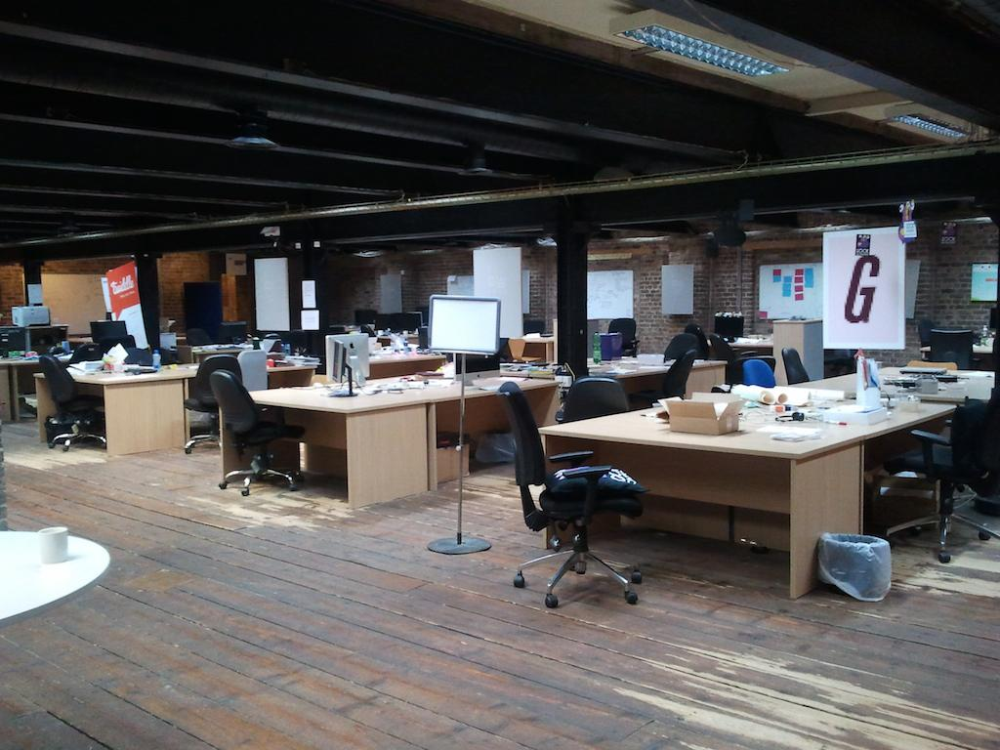
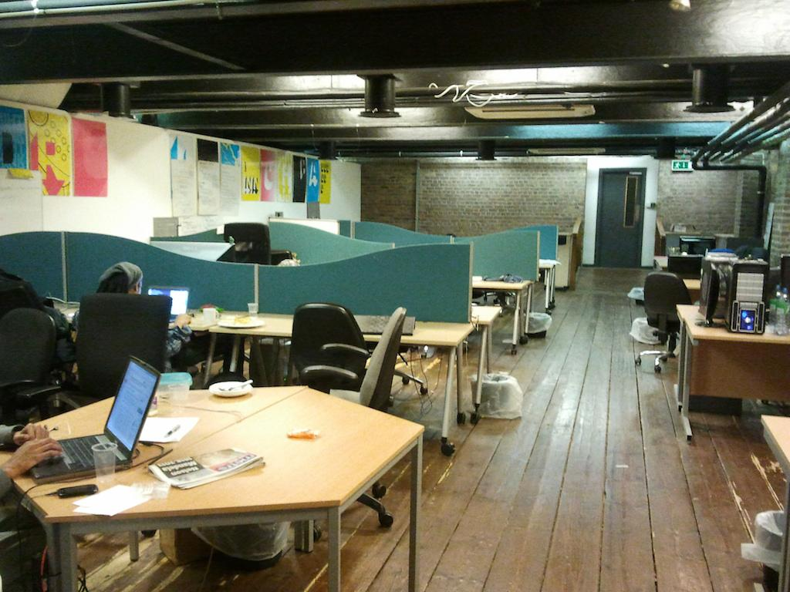
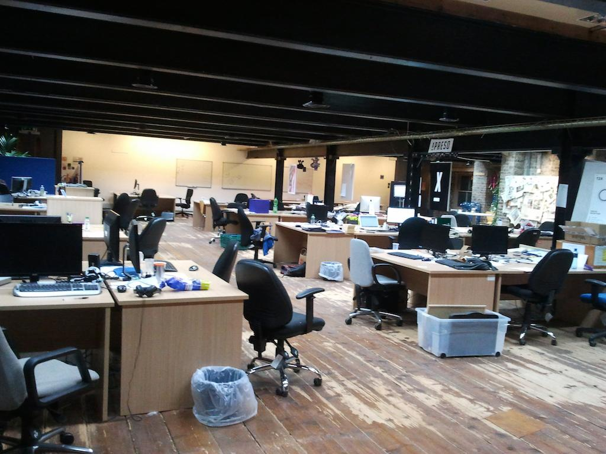
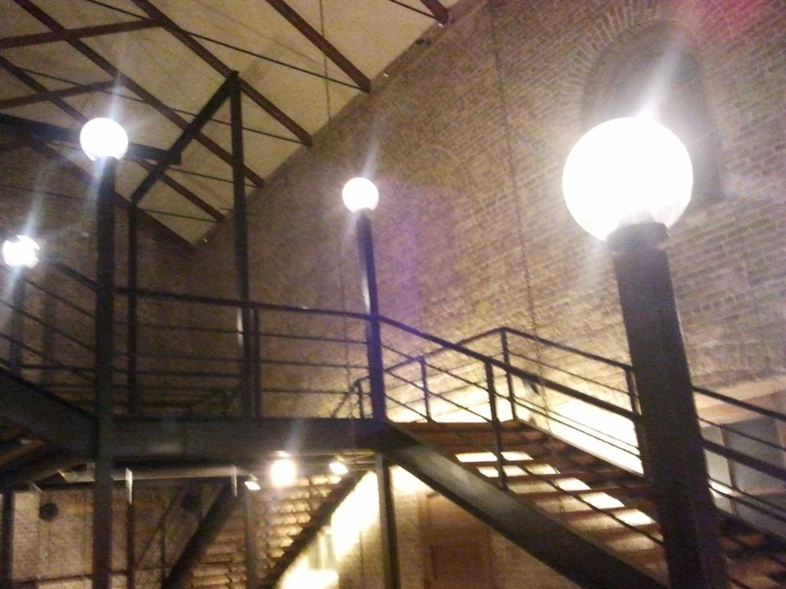
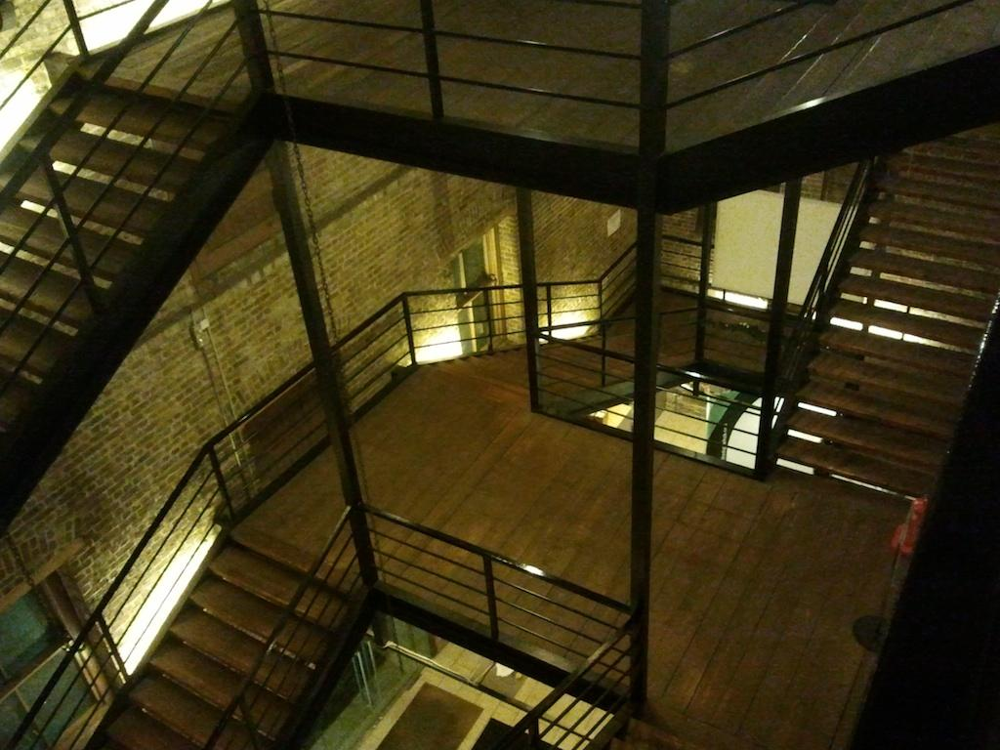
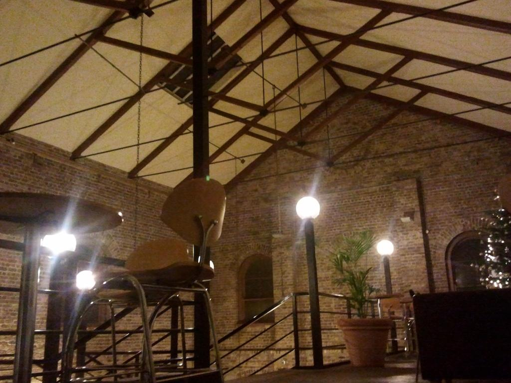
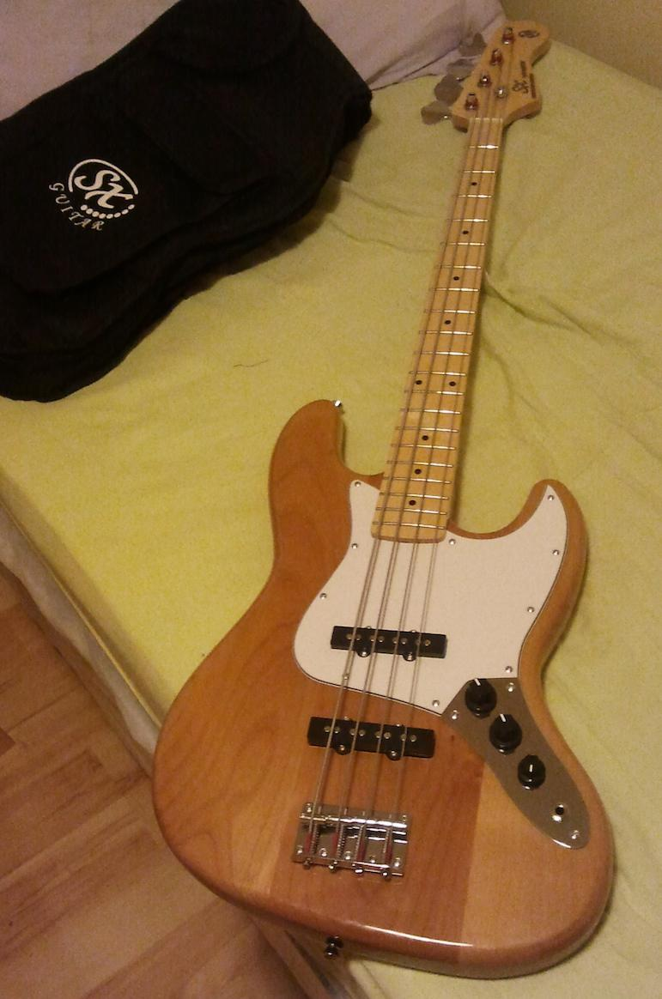
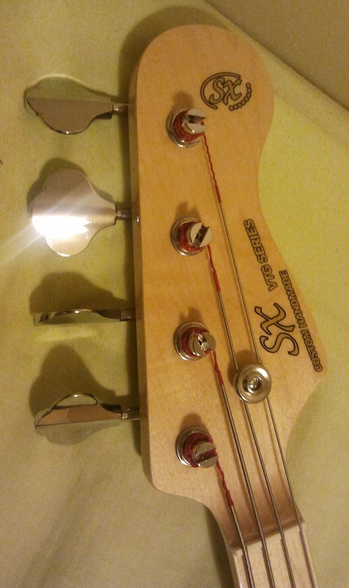
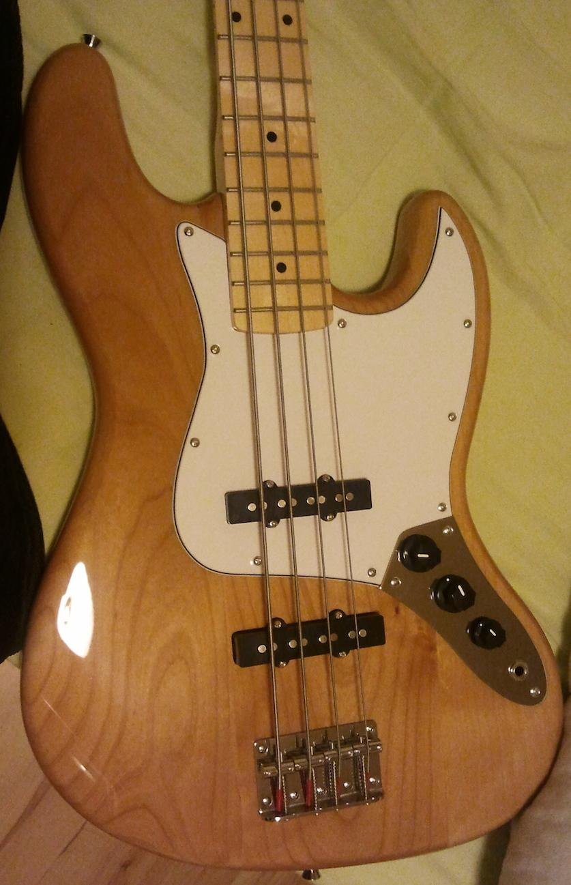

Eu sou um blogueiro terrível! Deixo isso aqui abandonado por longos períodos... Agora mudando para o assunto que deve ser tratado neste blog: o que tem acontecido em minha vida aqui na Irlanda.

Eu e uns finlandeses malucos que conheci no ‘The Celt’. Bons caras...

## // Mudança de casa.

Eu paguei 15 dias de acomodação, na casa da agência de intercâmbio, antes de sair do Brasil. E desde antes da viagem eu já sabia qual era a melhor forma de procurar um aluguel - <a href="http://daft.ie" target="_blank">daft.ie</a>. Nesse site é possível fazer diversos filtros (localidade, valor mínimo e máximo, quando eu posso me mudar etc.) e ainda criar <i>newsletters</i> a partir desses filtros. Daí enviam direto pro seu email toda vez que uma nova residência com os requisitos escolhidos for postada no site.

Nesse site são publicados diversos imóveis por dia, tanto pra alugar sozinho quanto pra dividir (o que nós, estudantes, normalmente procuram) com outras pessoas. Isso me deu a falsa ilusão de que é muito fácil arrumar um lugar pra ficar aqui. Na primeira semana eu relaxei e nem me preocupei com aluguel. Na segunda semana, descobri que arrumar uma casa não é tão fácil quanto eu imaginava. Diversos anúncios são postados, nem todos com telefone do anunciante, tendo como forma de entrar em contato um formulário dentro do próprio site. Problema: pouquíssimos anunciantes respondem. Outros são legais, colocam o telefone :). Problema: vários não atendem o telefone ¬¬. Outros são legais de verdade e atendem o telefone. É marcado um horário para visitar a casa. A visita é pra conhecer os residentes da mesma e saber se está tudo certo sobre a mudança: eu gostar da casa e os residentes gostarem de mim.

Acabei renovando com a agência pra ficar no apartamento deles por mais 15 dias, assim poderia procurar uma casa com mais calma.

Eles conseguiram a renovação pra mim, entretanto, em um outro apartamento no mesmo bloco. Nessa mudança, eu deixei de morar com o meu brother <i>minêro</i> e fui pra o novo apartamento, que só tinha uma menina venezuelana que estava saindo no mesmo dia. Acabei ficando sozinho até o dia seguinte, que estava programado pra chegar 5 pessoas na casa.
No dia seguinte, chega o novo pessoal com um bocado de malas! 5 pessoas e mais do que 10 malas. Nessa eu conheci esse pessoal gente boa: Pedro, Mariana, Mariano, Marina e William! O Pedro veio pra passar um bocado de tempo, os outros estavam a passeio. Durante 15 dias eu morei com essa galera e foi bem *massa*.

## // Job

Eu não tinha pretensão nenhuma de conseguir um emprego tão cedo por aqui. Na minha opinião, o meu inglês é muito ruim pra conseguir um emprego. Além do mais, eu juntei dinheiro no Brasil durante um bom tempo justamente pra não ter esse tipo de preocupação por aqui.

Maaas existe um grupo, no google groups, de profissionais de <a href="https://groups.google.com/forum/#!forum/it-irlanda-br">TI na Irlanda</a>. Eu acesso esse grupo já há bastante tempo, mesmo não sendo bastante ativo nele. Um cara postou lá sobre uma vaga de estágio *não-remunerado* em uma startup pra trabalhar com umas tecnologias que eu gosto bastante. Eu sequer tenho um currículo em inglês e meu <i>linkedin</i> não é atualizado (e eu não gosto do <i>linkedin</i>). Eu gostei da vaga e queria tentar, não custava nada. Falei com o cara que postou no grupo (Rodrigo) e peguei o email do <i>founder</i> da startup. Me dediquei bastante pra escrever uma boa introdução sobre mim e enviei. Resposta pra cá, resposta pra lá, uma entrevista na segunda, outra (técnica) na quarta e *pumba*(¿)! Sexta-feira (6/dez) comecei a trabalhar como <i>intern</i> na <a href="http://mobstats.com" target="_blank">MobStats.com</a>

A MobStats fica localizada no *Digital Hub*, uma área de Dublin com alguns prédios específicos pra pequenas empresas de tecnologia, marketing e publicidade. O prédio que estou, por exemplo, é específico para startups que estão iniciando no programa de aceleração da <a href="http://www.ndrc.ie/" target="_blank">NDRC</a>. É um antigo galpão da Guinness e que agora serve de espaço para o ponta-pé inicial das idéias que ganham uma vaga no processo da *NDRC*. Como eu já disse, é um galpão, nele tem diversas mesas grandes, cada uma é pertence a uma startup. O colaborador chega na mesa da sua startup, escolhe uma cadeira, liga o notebook e começa a trabalhar.

A idéia por trás da MobStats é criar interação entre torcedores e times através de aplicativos pra smartphone. Estamos em fase de construção e aprendizado (sempre!) do produto. Temos um bocado de chão pela frente e eu sinceramente espero que dê certo - mesmo sabendo que o mercado de startups (inovação) é muito difícil.

Ah véi, olha que prédio massa! É muito bom ir trabalhar lá.

## // Mudança de casa (again)

Uma restrição inicial minha foi escolher uma casa que não tivesse nenhum brasileiro morando. É claro que eu gosto da nossa galera, inclusive só conheci gente boa por aqui, mas o meu foco é aprender inglês e poder praticar o idioma onde eu estiver. Diversos alugueis de lugares que pareciam ser ótimos e com preço em conta eu dispensei só por não atender a essa restrição. Olhei outros lugares que só tinham estrangeiros morando mas não fiquei satisfeito - a casa era no centro, o preço do aluguel era ótimo mas em compensação o lugar era um moquifo: apertado, moveis velhos e sujos. Já que eu não estava conseguindo trabalhar com essas três variáveis - preço baixo, estrangeiros e bom lugar - eu tive de adicionar outra pra conseguir flexibilizar um pouco mais a pesquisa: distância.

Durante um tempo pesquisei por casas mais longe do centro da cidade - lugares onde se torna necessário a utilização de transporte público. Achei um bom anuncio em um bairro um pouco mais afastado do centro chamado Clondalkin (Dublin 22) e fui ver o lugar pra ver se era bom. É uma casa pra três pessoas e uma estava saindo. Quartos independentes, casa organizada, limpa, móveis novos... O lugar é ótimo e, sendo um <i>single</i>, o preço não está tão alto: €300. Nessa casa moram um irlandês: Patrick, 47 anos, apaixonado por futebol, geografia e história; e uma italiana: Carmen, 33 anos, advogada, espanhol fluente e inglês ótimo. O Patrick trabalha quase todos os dias durante o dia e a Carmen está procurando emprego por aqui.

Porém eu só poderia ir pra essa nova casa no dia 14 de dezembro, que era o dia em que a pessoa que estava liberando minha vaga saia. Eu quase renovei mais uma semana com a agência, mas uma <i>classmate</i> muito gente boa falou que tinha uma vaga temporária na casa dela e eu aceitei. Fiquei uma semana morando lá pra então me mudar para a casa definitiva.

Foi uma ótima semana, conheci mais pessoas ótimas e passou em um instante! Valeu aí Mariana, Luiza, Renata, Özlem e Fernanda!

## // Mudança de casa - definitiva agora.

&nbsp;

Estou muito bem acomodado agora. É muito bom ter um quarto meu de novo. Não vou me alongar em palavras, olha aí como é o local:

<iframe class="post-video" src="http://www.youtube.com/embed/N6PN5G9jDB0?html5=1" width="100%" height="385">unwantedtext</iframe>

## // Holidays

Entrei em holidays, tanto na escola como no trabalho, ficar praticamente duas semanas sem aula e trabalho. Esquisito, não? Da escola eu até entendo, mas achei esquisito ter isso no trabalho. É claro que nem todos os empregos funcionam desse jeito, mas lá nós temos. De qualquer forma, estou tendo de estudar um bocado de coisas novas pra aplicar na MobStats. As férias estão boas por que posso ficar em casa e também não tenho custo com ônibus :)	

## // New partner (presente)

Aaaahhhhhh garooooto! Que lindo, não? Estamos tendo bastante diversão juntos.

## // Música

E um pouco de música desta bela cidade.

<iframe class="post-video" src="http://www.youtube.com/embed/4F7mi3j8ULg?html5=1" width="100%" height="385">unwantedtext</iframe>
<iframe class="post-video" src="http://www.youtube.com/embed/qSmstSR4PAM?html5=1" width="100%" height="385">unwantedtext</iframe>

É isso aí! A vida continua uma ralação mas está bem divertido. Um monte de afazeres, só que agora não posso dividir tarefa nenhuma com ninguém, é tudo por minha conta. Por enquanto vai indo tudo bem, tudo dando certo. E esse sou eu até o momento (#chatiado hahahah):

Bye.
